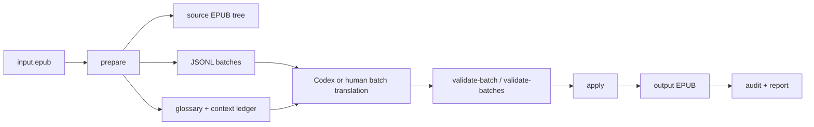

# Architecture

## Shape

Babel is a dependency-free Python CLI. It is intentionally not a Codex plugin. The core value is file transformation and validation; agent orchestration is a workflow layered on top.

## Pipeline

1. `prepare` extracts the EPUB into `work_dir/source`.
2. `prepare` reads `META-INF/container.xml`, finds the OPF package, reads the manifest and spine, and walks XHTML body elements.
3. Translatable elements are serialized as XHTML snippets and written to `blocks.jsonl`.
4. Blocks are grouped into chapter/file-aware JSONL batches.
5. Translators write matching rows with `translated_html`.
6. Validators compare source and translated snippets.
7. `apply` copies the source tree, replaces validated nodes, updates optional metadata, and packages the EPUB.
8. `audit` unpacks the output and checks structural integrity.

## Validation Boundaries

Babel validates structure, not literary quality. It can detect malformed snippets, changed IDs, changed links, missing rows, extra rows, placeholder text, and suspiciously long untranslated Latin text. It cannot prove that a translation is elegant or contextually perfect.

## Why CLI First

A plugin would couple Babel to one agent host. A skill alone would only document a process. A CLI gives stable behavior that any agent, human, script, or CI job can call. The recommended model is:

- Core: `babel-epub` CLI.
- Optional: Codex skill or prompt pack that teaches agents how to orchestrate the CLI.
- Optional later: provider adapters outside the core package.

## Data Policy

Generated workspaces contain book content and must stay local. The repository `.gitignore` excludes EPUB files, JSONL batches, output reports, and work directories.
