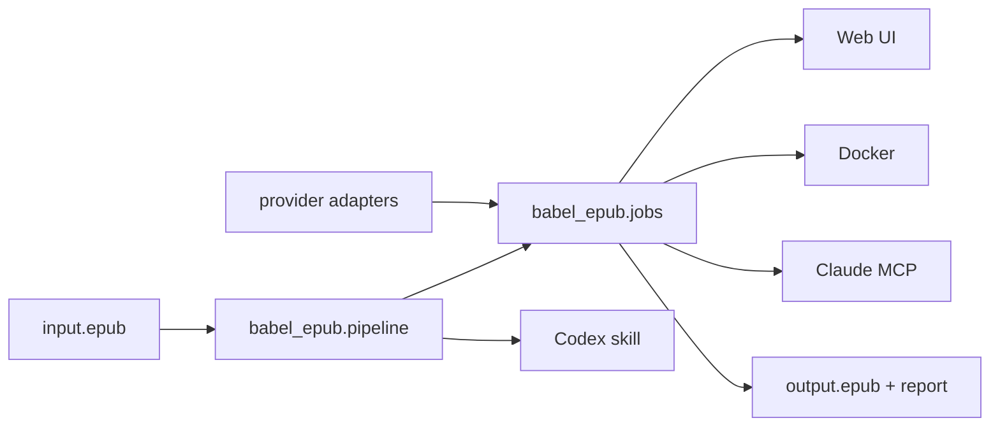

# Architecture

## Shape

Babel is a dependency-free Python package with multiple adapters. The core value is file transformation and validation; Web, Docker, Codex, and Claude are integration layers over the same pipeline.

## Pipeline

1. `prepare` extracts the EPUB into `work_dir/source`.
2. `prepare` reads `META-INF/container.xml`, finds the OPF package, reads the manifest and spine, and walks XHTML body elements.
3. Translatable elements are serialized as XHTML snippets and written to `blocks.jsonl`.
4. Blocks are grouped into chapter/file-aware JSONL batches.
5. Translators write matching rows with `translated_html`.
6. Validators compare source and translated snippets.
7. `apply` copies the source tree, replaces validated nodes, updates optional metadata, and packages the EPUB.
8. `audit` unpacks the output and checks structural integrity.

## Validation Boundaries

Babel validates structure, not literary quality. It can detect malformed snippets, changed IDs, changed links, missing rows, extra rows, placeholder text, and suspiciously long untranslated Latin text. It cannot prove that a translation is elegant or contextually perfect.

## Why CLI First

A plugin would couple Babel to one agent host. A skill alone would only document a process. The stable source of truth is the Python package and CLI, with a Web app and agent integrations layered on top.

- Core: `babel_epub.pipeline`.
- CLI: `babel-epub`.
- Web self-hosting: `babel-server`.
- Claude Desktop: `babel-mcp`.
- Codex: `integrations/codex/babel/SKILL.md`.

## Job Engine

`babel_epub.jobs` owns local job state under `BABEL_DATA_DIR`. It prepares workspaces, reads and writes the glossary, calls provider adapters batch by batch, validates outputs, applies translations, audits the final EPUB, and writes a report.

MVP is single-user and local-first. API keys are accepted at start time and are not written to durable job state.

## Data Policy

Generated workspaces contain book content and must stay local. The repository `.gitignore` excludes EPUB files, JSONL batches, output reports, and work directories.
