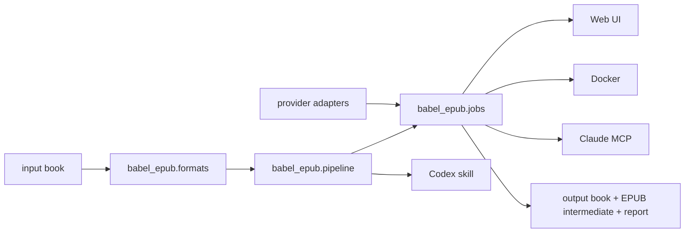

# Architecture

## Shape

Babel is a dependency-free Python package at the core with multiple adapters. The core value is file transformation and validation; Web, Docker, Codex, and Claude are integration layers over the same pipeline. The Web UI is React/Vite source under `web/`, built into `src/babel_epub/static/`, then served by `babel-server`.

## Pipeline

1. `prepare` normalizes the input book to `work_dir/input.epub`.
2. EPUB input is copied directly; TXT/HTML use Babel's internal converter; MOBI/AZW/PDF/DOCX/CBZ and similar formats use Calibre `ebook-convert`.
3. `prepare` extracts the normalized EPUB into `work_dir/source`.
4. `prepare` reads `META-INF/container.xml`, finds the OPF package, reads the manifest and spine, and walks XHTML body elements.
5. Translatable elements are serialized as XHTML snippets and written to `blocks.jsonl`.
6. Blocks are grouped into chapter/file-aware JSONL batches.
7. Translators write matching rows with `translated_html`.
8. Validators compare source and translated snippets.
9. `apply` copies the source tree, replaces validated nodes, updates optional metadata, and packages `work_dir/output.epub`.
10. `apply` exports the selected final output format from that EPUB intermediate.
11. `audit` unpacks the EPUB intermediate or EPUB final output and checks structural integrity.

## Format Layer

`babel_epub.formats` is responsible for input detection, input normalization, and final output export. EPUB remains the fidelity baseline. Non-EPUB inputs are converted into an EPUB intermediate before translation; non-EPUB outputs are exported from the validated EPUB intermediate after translation.

Native output is `.epub`. Calibre-backed output includes `.mobi`, `.azw3`, `.pdf`, `.docx`, `.txt`, `.html`, `.htmlz`, `.kepub`, `.rtf`, and `.fb2`.

## Validation Boundaries

Babel validates structure, not literary quality. It can detect malformed snippets, changed IDs, changed links, missing rows, extra rows, placeholder text, and suspiciously long untranslated Latin text. It cannot prove that a translation is elegant or contextually perfect.

## Why CLI First

A plugin would couple Babel to one agent host. A skill alone would only document a process. The stable source of truth is the Python package and CLI, with a Web app and agent integrations layered on top.

- Core: `babel_epub.pipeline`.
- CLI: `babel-epub`.
- Web self-hosting: `babel-server`.
- Claude Desktop: `babel-mcp`.
- Codex: `integrations/codex/babel/SKILL.md`.

## Job Engine

`babel_epub.jobs` owns local job state under `BABEL_DATA_DIR`. It prepares workspaces, reads and writes the glossary, calls provider adapters for each batch, validates outputs, applies translations, exports the selected output format, audits the EPUB intermediate, and writes a report.

MVP is single-user and local-first. API keys are accepted at start time and are not written to durable job state.

Translation runs use a `ThreadPoolExecutor` with default `max_concurrency=3` and a hard range of `1..8`. Each batch attempt creates its own provider instance. The glossary and context are read once at run start so concurrent batches share a stable snapshot.

Batch outputs are validated before they are written. If one batch fails, the engine records a `batch-failed` event and continues the other active and queued batches. After all workers finish, any failed batch leaves the job in `failed`; resume skips existing valid outputs and reruns only missing, damaged, or invalid batches.

Provider calls support a per-request timeout and retry count. Timeout, HTTP 429, and HTTP 5xx are retryable; HTTP 400/401 are treated as configuration or request errors and are not retried.

Jobs persist event logs plus active and failed batch metadata so the Web UI can restore progress after refresh and resume failed translations from existing valid batch outputs.

## Data Policy

Generated workspaces contain book content and must stay local. The repository `.gitignore` excludes common private ebook files, JSONL batches, output reports, and work directories.
